[中文](./README.zh.md) · **English**

# jfo-skills

My personal Agent Skill repo. Each top-level directory is a self-contained skill — one `SKILL.md` plus its own scripts and resources. Symlink it into your agent's skills directory and the agent discovers it, then loads it when the task calls for it.

No build step, no third-party dependencies: the scripts use only the Python 3 standard library, and credentials are always read from environment variables.

Every skill follows the open [Agent Skills](https://agentskills.io) standard, so any of the 40+ clients that implement it can load them — Claude Code, Codex, Qoder, Kimi Code, CodeBuddy, OpenCode, Cursor and others.

## Skills

| Skill | What it does | Key needed | Docs |
| --- | --- | --- | --- |
| **infographic-gen** | Turns the key points of a doc / SKILL / README into an infographic while preserving the source language. Ships three three-column style templates (cute cartoon, minimal business, tech-dark HUD) plus a library of 100 sample prompts (20+ visual styles, renderable straight from an index) | `DASHSCOPE_API_KEY` | [infographic-gen/SKILL.md](infographic-gen/SKILL.md) |
| **cli-dispatch** | Dispatches tasks to Codex CLI (`codex exec`) or Qoder CLI (`qodercli -p`) non-interactively: task-level selection of model, reasoning effort and sandbox/permission, result parsing from JSONL / JSON output, and session resume | — (local CLI login) | [cli-dispatch/SKILL.md](cli-dispatch/SKILL.md) |

## Infographic examples

### Built-in templates

The three built-in templates below were rendered with `qwen-image-3.0-pro` from the same source content, making their visual differences easy to compare.

<table>
  <tr>
    <td align="center">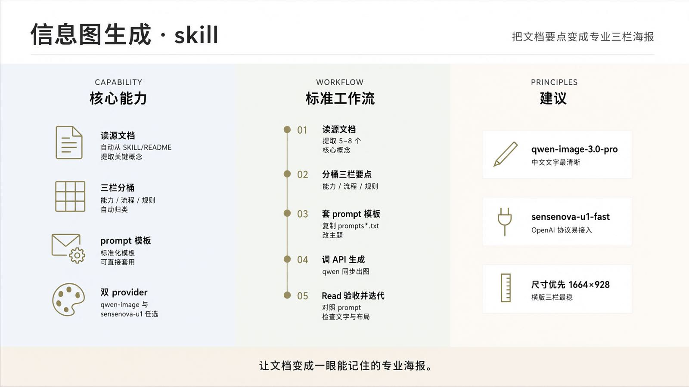<br><sub><b>Minimal business</b></sub></td>
    <td align="center">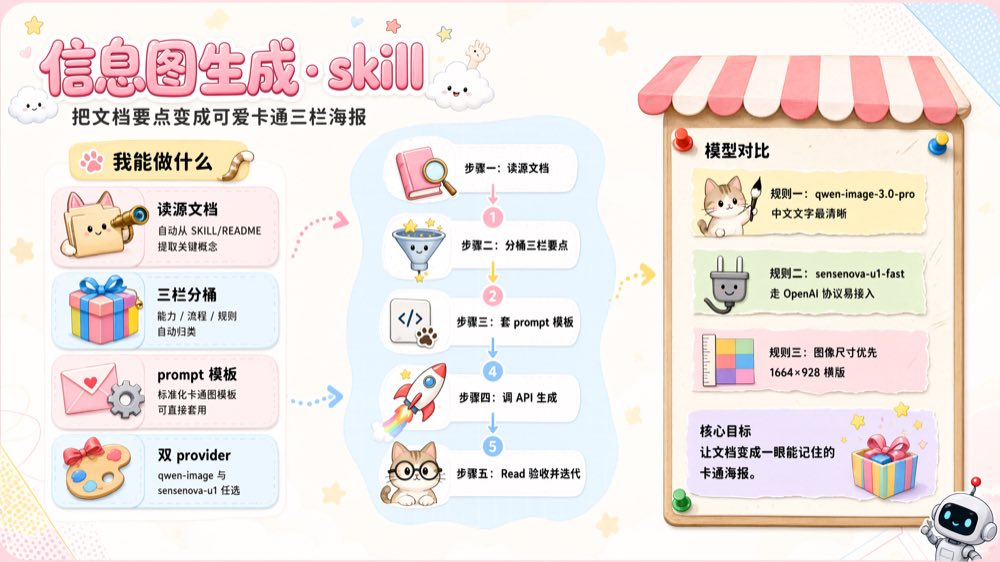<br><sub><b>Cute cartoon</b></sub></td>
    <td align="center">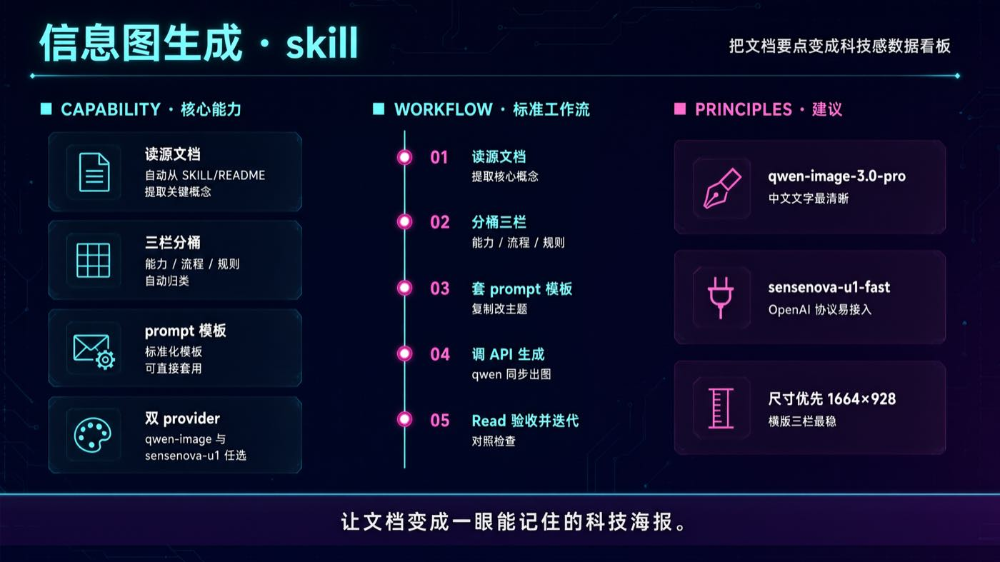<br><sub><b>Tech-dark HUD</b></sub></td>
  </tr>
</table>

### 15 styles selected from the 100-prompt library

The sample library covers different subjects, languages, aspect ratios, information structures, and visual treatments. These 15 renders provide a quick overview; use the [sample library index](infographic-gen/references/sample-library.md) to browse all 100 prompts.

<table>
  <tr>
    <td align="center">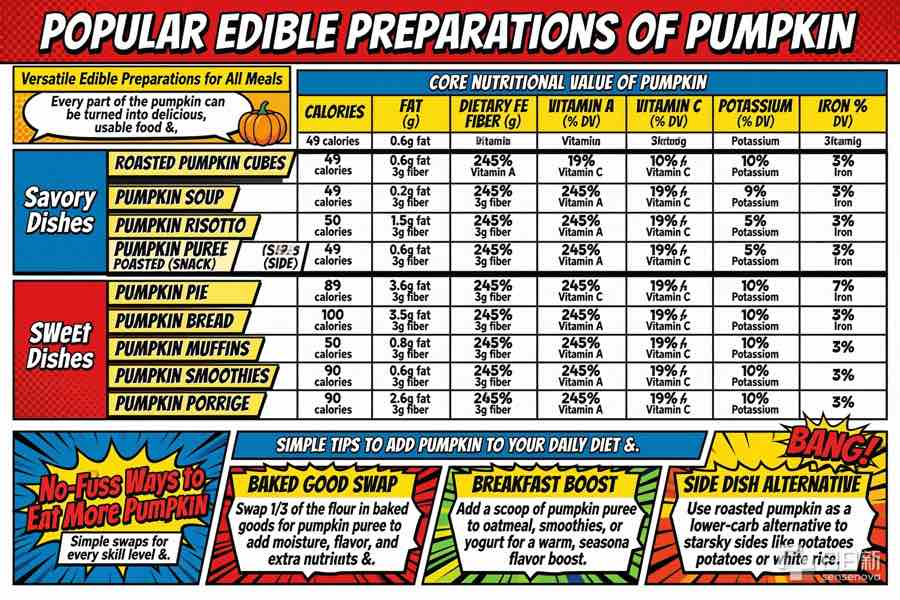<br><sub><b>Comic book</b> · #26</sub></td>
    <td align="center">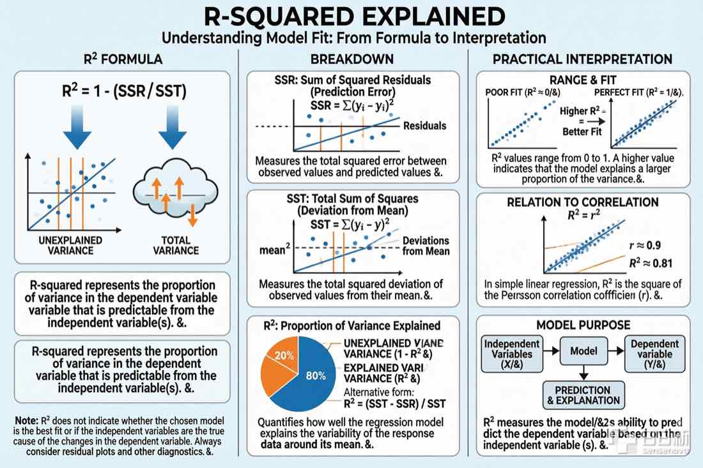<br><sub><b>Data chart</b> · #28</sub></td>
    <td align="center"><br><sub><b>Watercolor</b> · #34</sub></td>
  </tr>
  <tr>
    <td align="center">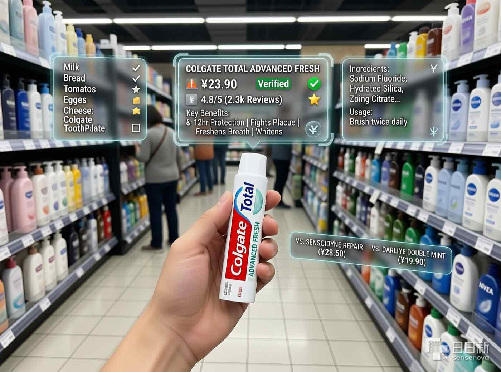<br><sub><b>AR interface</b> · #35</sub></td>
    <td align="center">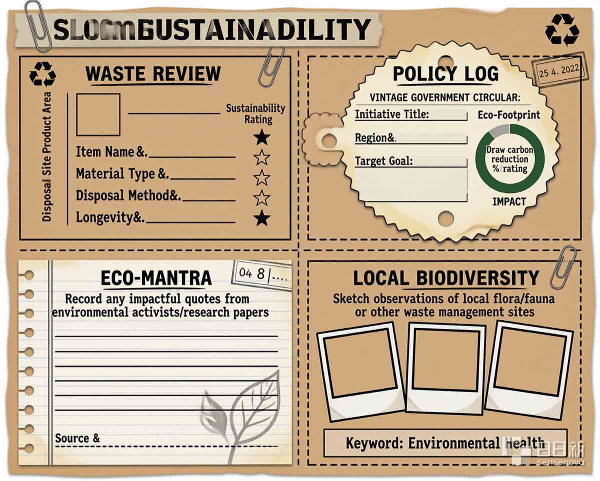<br><sub><b>Grid</b> · #42</sub></td>
    <td align="center"><br><sub><b>Mechanical</b> · #45</sub></td>
  </tr>
  <tr>
    <td align="center">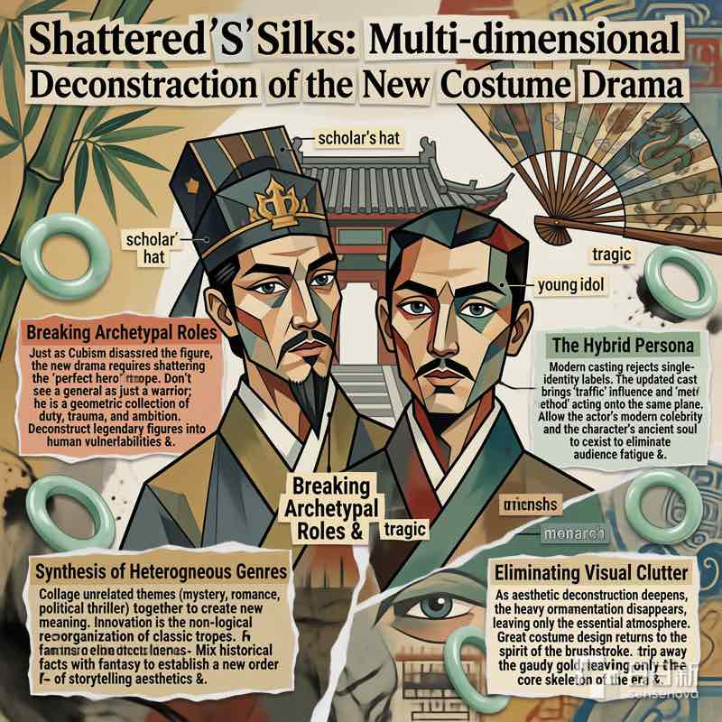<br><sub><b>Chinese ink</b> · #51</sub></td>
    <td align="center"><br><sub><b>Blueprint collage</b> · #53</sub></td>
    <td align="center">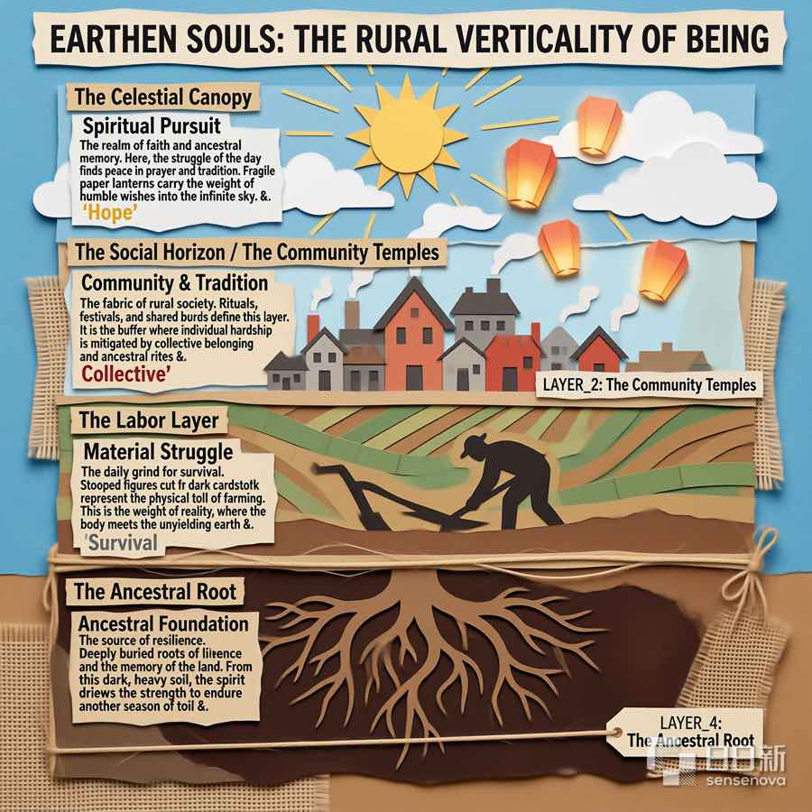<br><sub><b>Archival</b> · #54</sub></td>
  </tr>
  <tr>
    <td align="center"><br><sub><b>Oil / Baroque</b> · #56</sub></td>
    <td align="center">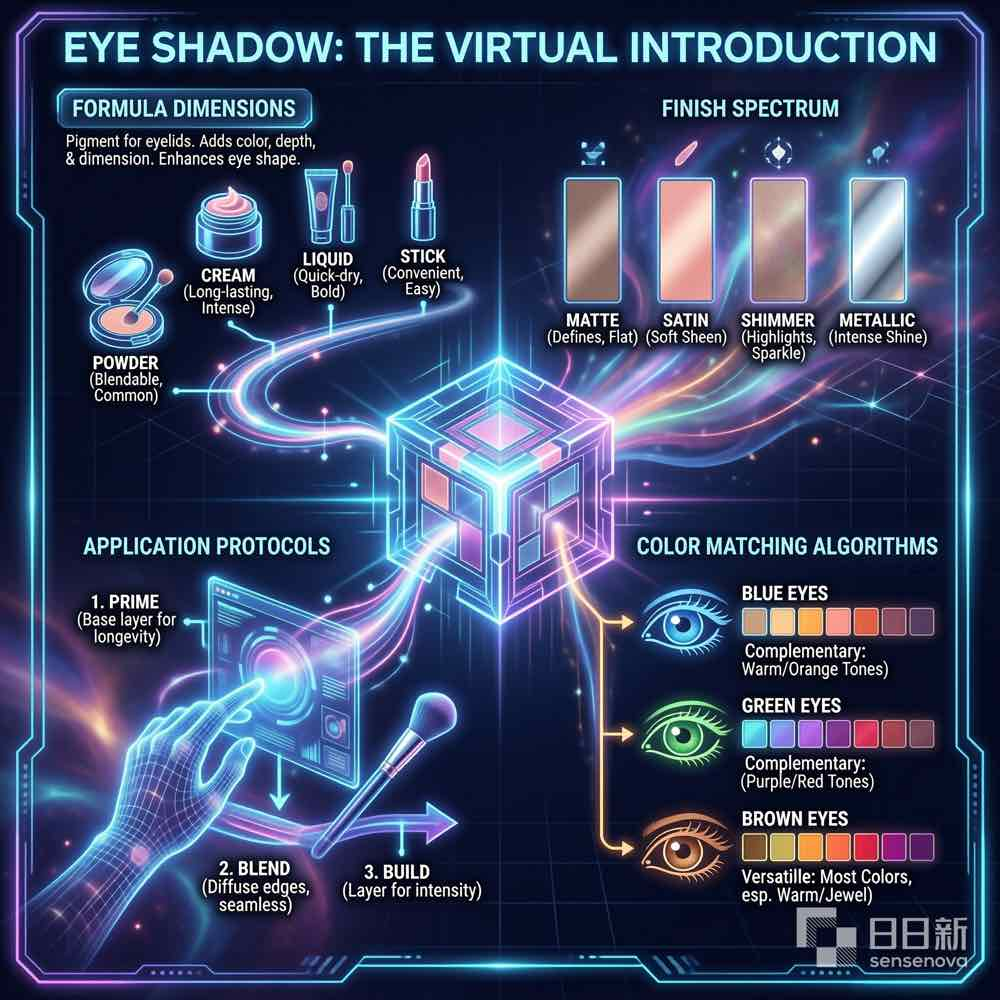<br><sub><b>Cyberpunk</b> · #63</sub></td>
    <td align="center"><br><sub><b>Biomedical</b> · #64</sub></td>
  </tr>
  <tr>
    <td align="center">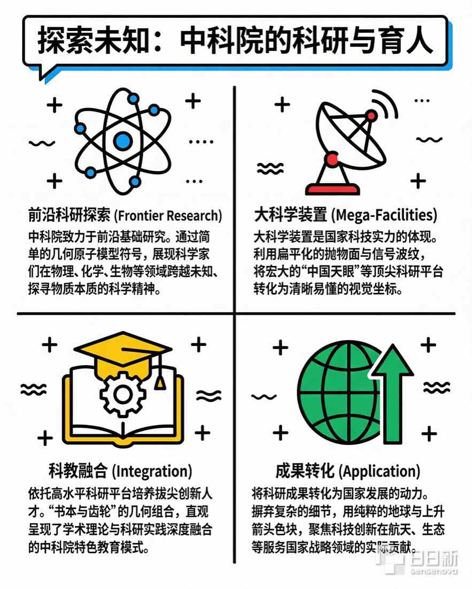<br><sub><b>Flat vibrant</b> · #67</sub></td>
    <td align="center">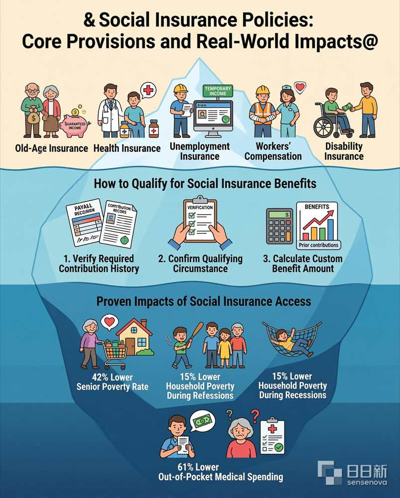<br><sub><b>Iceberg</b> · #70</sub></td>
    <td align="center">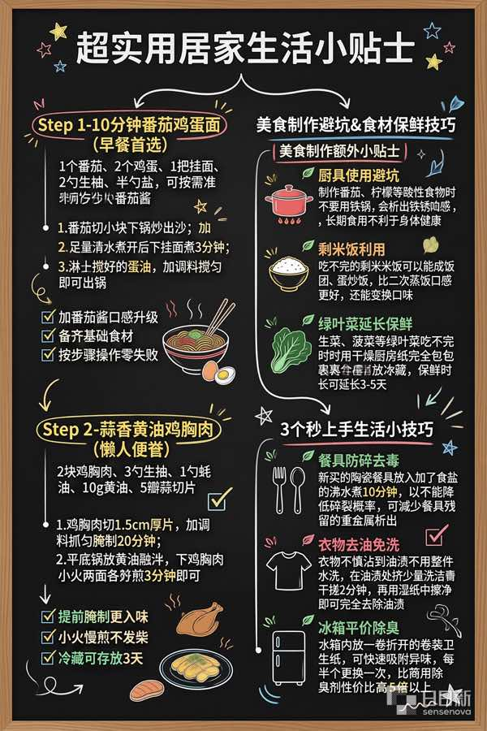<br><sub><b>Chalkboard</b> · #85</sub></td>
  </tr>
</table>

## Installation

### Option 1: let the agent install it

In Claude Code, Codex or any other tool that supports Agent Skills, just say:

```
Install this skill for me: https://github.com/jfojfo/jfo-skills/tree/main/infographic-gen
```

The agent clones it into the right directory itself — you don't have to think about paths.

### Option 2: clone + symlink

Use this if you also want to edit the skill: change it once in the repo and every agent picks it up immediately, no re-copying.

```bash
git clone https://github.com/jfojfo/jfo-skills.git
cd jfo-skills && REPO=$(pwd)

# Claude Code
ln -s "$REPO/infographic-gen" ~/.claude/skills/infographic-gen

# Codex
ln -s "$REPO/infographic-gen" ~/.codex/skills/infographic-gen

# Qoder
ln -s "$REPO/infographic-gen" ~/.qoder/skills/infographic-gen
```

### Uninstall

Just delete the symlink; the repo is untouched: `rm ~/.claude/skills/infographic-gen`

### If your agent doesn't support skills

Download the full `infographic-gen/SKILL.md`, use it as a project rules file, or simply paste it into the conversation and let the agent follow it. The result is the same — a skill is just a structured set of instructions and needs no runtime.

## Environment variables

| Variable | Purpose | Required |
| --- | --- | --- |
| `DASHSCOPE_API_KEY` | Alibaba Cloud Model Studio (qwen-image-3.0-pro), the default provider for infographic-gen | Yes |
| `SENSENOVA_KEY` | SenseNova (sensenova-u1-fast), the alternative provider | Optional |

Put them in `~/.zshrc` to persist. All three scripts check for the key before sending a request and exit telling you which variable is missing, so they never call the API with an empty key. **Image generation costs money or burns free quota** — check your balance before batch-running the sample library.

## How to trigger it

Once installed and the key is set, just ask in natural language; the agent matches on the skill's `description`:

```
Turn our team wiki's onboarding guide into a cute cartoon-style infographic
Summarize this doc into a minimal business-style infographic, landscape, for next week's review
Make a tech-dark HUD infographic from this gateway design doc, for the architecture review
Turn the code architecture into an architecture infographic
Generate a tech-dark style architecture infographic
Render sample #13 from the prompt library
Same content again with sensenova so I can compare
```

You can also name it explicitly: type `$infographic-gen` in Codex, or just say "use infographic-gen" in Claude Code / Qoder.

Note on language: infographic-gen preserves the language of the source content by default. The bundled examples include Chinese, English, and mixed-language layouts; the image models may still misspell or distort dense text, so always inspect the final render.

## A note on repo size

The comparison examples under `infographic-gen/examples/` account for most of the repo. If you only want the docs, shallow-clone it: `git clone --depth 1`.

## License

[MIT](LICENSE), covering this repo's own scripts and documentation.

The 100 sample prompts in `infographic-gen/prompts/samples_infographic.jsonl` were collected from public sources and serve only as visual reference when writing your own prompts; rights to them remain with their original authors.
